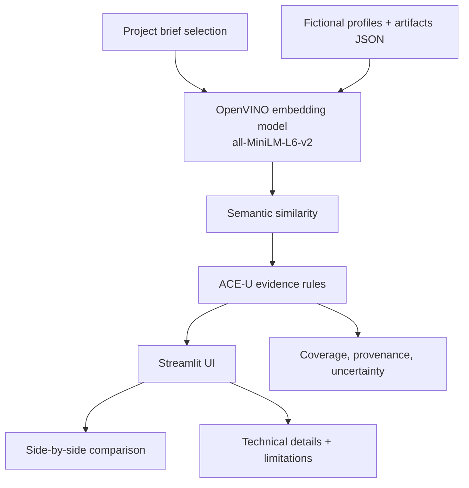

# ACE-U Evidence Explorer

A synthetic, OpenVINO-backed evidence explorer that demonstrates how semantic similarity can surface relevant artifacts, provenance, and context for a conceptual ACE-U review of professional identity.

This project is an illustrative reference implementation inspired by Shubham Anandani, “Trust-Aware Professional Identity Representation in AI-Mediated Systems,” SoutheastCon 2026. It is not a validated hiring system, not an employment decision tool, and not an empirical ACE-U scoring model.

## Paper attribution

- Paper: Shubham Anandani, “Trust-Aware Professional Identity Representation in AI-Mediated Systems,” SoutheastCon 2026.
- This demo is informed by the paper’s ideas around observable evidence, provenance, uncertainty, contextual explanations, consent, and responsible evaluation.
- This repository intentionally adds a new demo design choice: a transparent, inspectable evidence explorer built around semantic retrieval over fictional profiles and synthetic artifacts, with a clear explanation that embedding similarity is not identity verification.

## What is inspired by the paper vs. new design choices

Inspired by the paper:
- ACE-U conceptual dimensions: authenticity, credibility, empathy, and uniqueness.
- Importance of observable evidence, not hidden personality claims.
- Requirement for provenance and uncertainty handling.
- Need to distinguish evidence coverage from a final judgment.

New demo design choices:
- Synthetic fictional profiles only, never real people or scraped profiles.
- OpenVINO-backed semantic retrieval using a public embedding model for explanation support only.
- Documented illustrative rules and thresholds rather than a claimed scoring model.
- Side-by-side comparison for credential-only signals missing nontraditional work.
- Local-only use and explicit “not for hiring” disclaimers.

## Architecture overview



## Repository structure

- `app.py` — Streamlit entry point.
- `src/aceu_evidence_explorer/` — domain logic, OpenVINO embedder, ACE-U rules, data loading, and benchmark support.
- `data/` — fictional profiles and project briefs in JSON.
- `tests/` — deterministic unit tests and optional OpenVINO integration test.
- `docs/model_card.md` — model purpose, provenance, and limitations.
- `docs/screenshots/` — optional local screenshot capture folder.

## Setup

### 1) Create a virtual environment

```bash
cd aceu-openvino-evidence-explorer
python3 -m venv .venv
. .venv/bin/activate
python -m pip install --upgrade pip
pip install -r requirements.txt
```

### 2) Apple Silicon Mac (M4) run path

```bash
cd aceu-openvino-evidence-explorer
. .venv/bin/activate
streamlit run app.py --server.headless true --server.port 8501
```

### 3) Intel x86-64 CPU run path

```bash
cd aceu-openvino-evidence-explorer
python3 -m venv .venv
. .venv/bin/activate
python -m pip install --upgrade pip
pip install -r requirements.txt
streamlit run app.py --server.headless true --server.port 8501
```

## Model and licensing notes

This project uses `sentence-transformers/all-MiniLM-L6-v2` with `SentenceTransformer(..., backend="openvino")` on CPU.

- Model family: `sentence-transformers/all-MiniLM-L6-v2`
- OpenVINO backend: Sentence Transformers + `optimum-intel`
- Model license: verify the current Hugging Face license before redistribution or publication.
- Large model weights are not committed; on first run the model is downloaded into the local Hugging Face cache.
- For offline use: pre-download the model and run with the app using the cached store.

Example offline warm-up:

```bash
cd aceu-openvino-evidence-explorer
. .venv/bin/activate
HF_HUB_OFFLINE=1 python - <<'PY'
from sentence_transformers import SentenceTransformer
SentenceTransformer('sentence-transformers/all-MiniLM-L6-v2', backend='openvino', device='CPU')
print('cached')
PY
streamlit run app.py --server.headless true --server.port 8501
```

## Data provenance and ethics

The application uses only fictional synthetic data. Provenance labels are explicit and honest:

- `synthetic_self_report`
- `synthetic_third_party_artifact`
- `synthetic_internal_note`

These labels are not evidence of validation or credential trust. Similarity is used only as a contextual signal for explanation.

## Run tests

```bash
cd aceu-openvino-evidence-explorer
. .venv/bin/activate
pytest -q
```

Optional real inference integration test:

```bash
cd aceu-openvino-evidence-explorer
. .venv/bin/activate
RUN_OPENVINO_INTEGRATION=1 pytest -q tests/test_integration_openvino.py
```

## Benchmark command

```bash
cd aceu-openvino-evidence-explorer
. .venv/bin/activate
python -m aceu_evidence_explorer.benchmark
```

This benchmark compares the same embedding model and inputs on PyTorch CPU vs. OpenVINO CPU, capturing warm-up time, repeated runs, p50/p95 latency, throughput, and environment details.

## Demo walkthrough (60–90 seconds)

1. Launch the app.
2. Pick a project brief and a fictional profile.
3. Review the ranked artifact matches with provenance labels.
4. Inspect the ACE-U explanation panel and note that it is not a model-predicted trust score.
5. Open the side-by-side comparison to see why credential-only views can miss relevant work or nontraditional paths.
6. Read the limitations panel and stop before interpreting the output as a hiring recommendation.

## Screenshot plan

To generate reproducible screenshots:

1. Run the app with the app in a browser.
2. Use the same brief and profile selections for all screenshots.
3. Save output under `docs/screenshots/`.
4. Attach the exact selection values and time/date in a markdown note if needed for publication.

## Responsible use and limitations

- This is a synthetic demo, not a validated assessment system.
- Embedding similarity does not verify identity, authenticity, or trustworthiness.
- The ACE-U mapping is illustrative and configurable, not a scientifically validated score.
- No visitor-entered text is retained or logged.
- This project is not for hiring, credentialing, or employment decisions.

## Sharing in an Intel Software Innovator application

If you plan to share this repository in an Intel Software Innovator application:

1. Confirm there is no employer-owned or personal data in the repo.
2. Clearly state that this is an independent synthetic demo, not an Intel product or validated corporate system.
3. Include the paper attribution, local setup commands, limitations, and the model card.
4. Do not claim Intel affiliation, program acceptance, or validation unless you have formal approval.

## License

This project is released under the MIT License.

## Troubleshooting

If OpenVINO fails to initialize:

```bash
. .venv/bin/activate
python - <<'PY'
from sentence_transformers import SentenceTransformer
model = SentenceTransformer('sentence-transformers/all-MiniLM-L6-v2', backend='openvino', device='CPU')
print('OK', model.device)
PY
```

If this fails, confirm the pinned versions in `requirements.txt` and that the model cache is reachable.

## Additional notes

- CPU is the default device.
- The app intentionally labels all data as synthetic.
- Model weights are not committed to the repo.
- This project is suitable for local review and demo use only.
